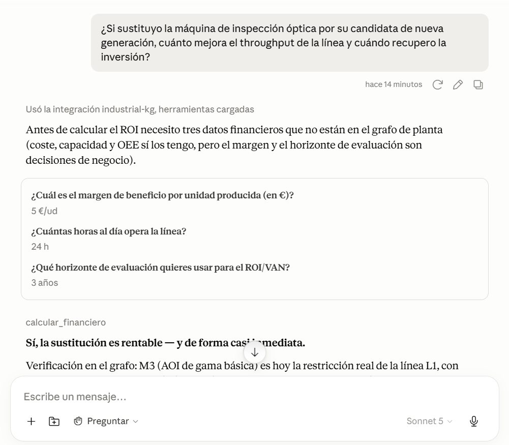
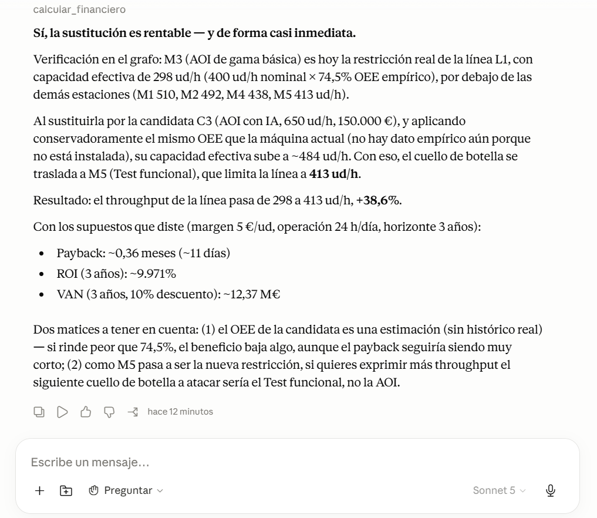
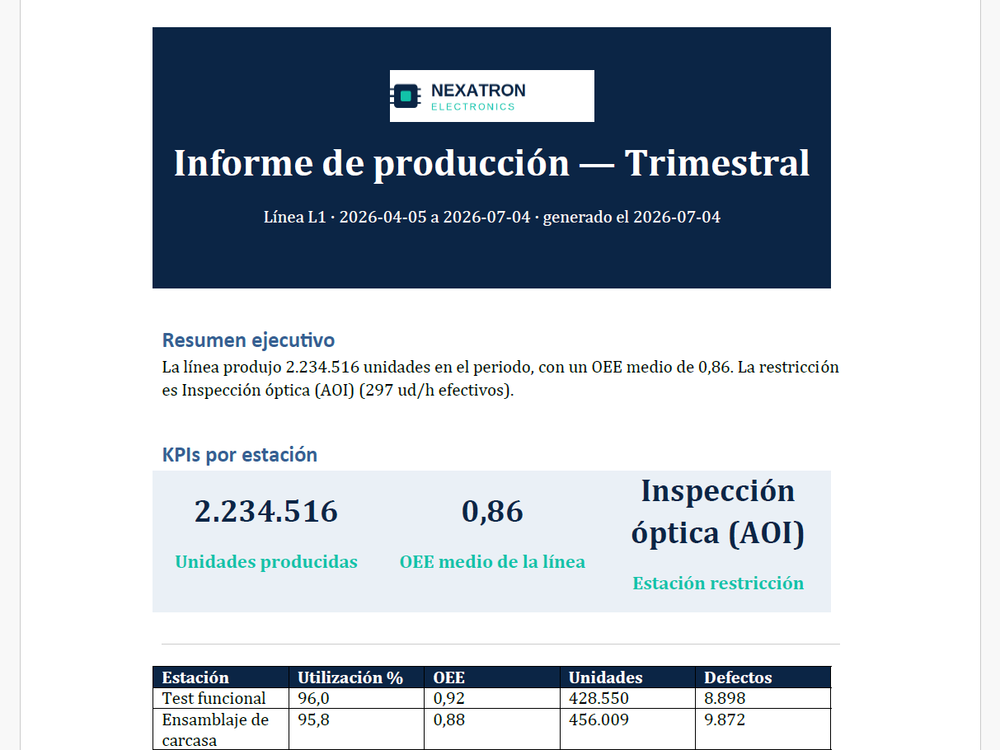

# Industrial Agentic Knowledge Graph

[](https://github.com/tomilb/industrial-agentic-kg/actions/workflows/tests.yml)

Un agente conversacional que razona sobre el estado real de una línea de
producción industrial — modelada como un grafo de conocimiento en Neo4j —
para responder preguntas de inversión, optimización y detección de cuellos
de botella con cifras trazables a datos reales, no generadas por el modelo.

> *"¿Si sustituyo la máquina de inspección óptica por una con IA, cuánto
> mejora el throughput de la línea y cuándo recupero la inversión?"*

El agente no "adivina" la respuesta: consulta el grafo, identifica la
restricción real de la línea aplicando teoría de restricciones, y calcula
el retorno de inversión con las cifras que acaba de obtener — todo
verificable, nada inventado.




*El agente nunca inventa datos que no tiene (pregunta margen, horas y
horizonte antes de calcular), aplica un supuesto conservador sobre el OEE
de la máquina nueva sin histórico, y detecta que tras la sustitución el
nuevo cuello de botella pasa a ser otra estación — 298→413 ud/h, no 298→650.*



*Informe trimestral generado por la tool `generar_informe`, con marca
corporativa, KPIs y recomendaciones basadas en datos reales del grafo.*

## El problema que resuelve

La mayoría de "asistentes de IA para planta" se quedan en leer manuales y
responder preguntas de documentación. Este proyecto va un paso más allá:
conecta un LLM a un modelo estructurado del estado real de una línea
(máquinas, costes, histórico de producción) para que pueda hacer
**razonamiento financiero y operativo**, no solo recuperación de texto.

## Qué puede responder

- ¿Cuánto mejora el throughput si sustituyo la máquina X por la candidata Y?
- ¿Cuándo recupero una inversión concreta, dado el margen y las horas de operación?
- ¿Qué estación es el cuello de botella de la línea ahora mismo, y por qué?
- ¿Ha cambiado la restricción respecto al periodo anterior?
- Genera el informe de producción del último trimestre, con gráficas y marca corporativa.

## Arquitectura

```
Datos sintéticos (pandas)
        │
        ▼
   graph/load_data.py  (carga idempotente, MERGE, nunca CREATE)
        │
        ▼
   Neo4j — knowledge graph de planta
   (Linea)-[:TIENE_ESTACION]->(Estacion)-[:OPERA]->(Maquina)
        │
        ▼
   Servidor MCP — 5 tools (mcp-server/server.py)
        │
        ▼
   Agente (Claude Desktop / API) ──► informe corporativo (docx)
```

El servidor habla el protocolo estándar **MCP** por stdio — Claude Desktop
es el cliente usado para desarrollo y demo, pero el mismo servidor es
utilizable desde la API de Anthropic o cualquier otro cliente compatible
con MCP, sin cambios.

## Las 5 herramientas del agente

| Tool | Qué hace |
|---|---|
| `consultar_grafo` | Specs de máquinas, topología de la línea, candidatas de sustitución — funciones semánticas, no Cypher libre |
| `calcular_financiero` | Payback, ROI y VAN sobre una inversión propuesta |
| `detectar_cuello_botella` | Identifica la estación restricción por capacidad efectiva (capacidad × OEE empírico del periodo), aplicando teoría de restricciones |
| `generar_informe` | Informe de producción en docx con marca corporativa, KPIs, 3 gráficas y recomendaciones basadas en datos reales |
| `consultar_manual_tecnico` | RAG sobre los manuales técnicos (mantenimiento, seguridad, instalación) con el índice vectorial nativo de Neo4j — sin base de datos vectorial aparte |

Todas devuelven JSON validado con Pydantic; los errores siempre son
estructurados (`{"error", "detalle"}`), nunca una excepción sin capturar.

## Escenario de demostración

Línea de ensamblaje de placas electrónicas (PCBA) con 5 estaciones. La
estación de inspección óptica (AOI) es, deliberadamente, el cuello de
botella real de la línea — con menor capacidad efectiva que las otras 4 —
para poder demostrar razonamiento de inversión con una base verificable.
Detalle completo en [`docs/ESCENARIO.md`](docs/ESCENARIO.md).

## Stack

Python 3.11 · Neo4j 5.24 (Docker, índice vectorial nativo) · MCP Python SDK ·
Pydantic · python-docx · matplotlib · sentence-transformers · pandas/numpy · pytest

## Metodología de desarrollo

Este proyecto se ha construido con **Claude Code** como asistente de
programación, bajo un flujo de trabajo deliberadamente supervisado: cada
funcionalidad se planteó primero en modo plan (revisando el diseño antes
de escribir código), cada cambio de código se revisó en diff antes de
aprobarlo, y cada herramienta se verificó dos veces — con tests
automáticos y con comprobación manual contra la base de datos real antes
de darla por cerrada. El razonamiento y las decisiones de diseño, incluidos
los errores encontrados y corregidos por el camino, están documentados en
[`docs/DECISIONS.md`](docs/DECISIONS.md).

Los commits en los que Claude Code ejecutó el `git commit` directamente
incluyen la coautoría estándar que añade por defecto
(`Co-Authored-By: Claude`) — se ha dejado así de forma intencionada, como
registro transparente de en qué partes del desarrollo tuvo intervención
directa la herramienta.

## Instalación y uso

```bash
git clone https://github.com/tomilb/industrial-agentic-kg.git
cd industrial-agentic-kg

python -m venv .venv
source .venv/Scripts/activate   # Windows con Git Bash
pip install -r requirements.txt

cp .env.example .env            # y añade tu password de Neo4j

docker compose up -d neo4j

python data-gen/generate.py --stations 5 --days 180
python graph/load_data.py
python graph/load_manuals.py    # 1ª vez: descarga el modelo de embeddings (~460 MB, una sola vez)
```

Conecta el servidor MCP a Claude Desktop siguiendo
[`docs/MCP_CLIENT_CONFIG.md`](docs/MCP_CLIENT_CONFIG.md), reinicia la app,
y prueba con una pregunta real en una conversación nueva.

## Decisiones de diseño destacadas

- **MCP en vez de tool-use directo vía API**: permite el mismo servidor
  conectado tanto a Claude Desktop (demo en vivo) como a la API (demo
  scriptada), y es la aplicación práctica directa de cómo se integran
  agentes con sistemas externos en producción.
- **Capacidad efectiva empírica, no solo capacidad nominal**: la primera
  versión de `detectar_cuello_botella` comparaba capacidad nominal de
  máquina, lo que en teoría de restricciones puede llevar a identificar
  la estación equivocada como cuello de botella. Corregido para usar
  capacidad efectiva (nominal × OEE real del periodo).
- **`calcular_financiero` recibe throughput de línea, no de máquina
  aislada**: sustituir la máquina más lenta no dispara el throughput a la
  capacidad de la máquina nueva — lo limita la *siguiente* estación más
  lenta. El agente lo aplica correctamente de punta a punta, verificado
  con datos reales.
- Historial completo de decisiones, con alternativas consideradas y
  motivos, en [`docs/DECISIONS.md`](docs/DECISIONS.md).

## Limitaciones conocidas (alcance consciente del MVP)

- **Una sola línea de producción.** El esquema del grafo ya es genérico
  (`Linea` no está hardcodeada), pero las tools asumen "la única línea"
  como atajo — soportar varias líneas requeriría hacer `linea_id`
  obligatorio en las tools y parametrizar el generador de datos.
- **Sin ingesta en vivo (MQTT/OPC UA).** Los datos son sintéticos,
  cargados una vez. La arquitectura de ingesta en tiempo real (MQTT →
  pipeline → grafo) es la misma que en un gemelo digital industrial real,
  pero no está implementada aquí por alcance de tiempo.
- **Sin visualización interactiva de la línea.** El razonamiento sobre
  cuellos de botella es completamente funcional; lo que falta es una
  representación visual tipo SCADA de la línea en tiempo real.
- **Cliente de desarrollo: Claude Desktop.** El servidor MCP es agnóstico
  al cliente (protocolo estándar por stdio); en un despliegue real en
  empresa se expondría de forma remota tras autenticación, consumido por
  una interfaz propia en vez de Claude Desktop.
- **Modelo financiero simplificado.** La tasa de descuento del VAN es fija
  (10% anual) y no ajustable por escenario; el informe automático usa un
  margen por unidad y un horizonte de evaluación fijos como constantes
  (no derivados del grafo), mientras que en la conversación con el agente
  esos mismos valores se piden explícitamente al usuario. El cálculo no
  incluye coste de instalación, parada de producción durante el cambio de
  máquina, ni ajuste de riesgo — válido para demostrar el razonamiento,
  no para una decisión de inversión real sin revisión adicional.
- **Verificación del agente manual, no automatizada.** `docs/EVAL_QUESTIONS.md`
  define ~15 preguntas de control (razonamiento financiero, cuellos de
  botella, RAG) que se ejecutan a mano en Claude Desktop tras cambios
  relevantes. La automatización natural sería un script contra la API de
  Anthropic con dos niveles de verificación: determinista (¿se llamó a la
  tool esperada? ¿coincide el valor con el fixture conocido?) y, para las
  respuestas en lenguaje natural, un segundo modelo actuando de juez. Se
  ha dejado manual deliberadamente para este MVP — con 15 preguntas
  ejecutadas en momentos puntuales, el coste de mantener un harness
  automatizado (y su facturación de API, separada de cualquier
  suscripción) no compensa frente a revisarlas a mano.

## Roadmap

- [ ] Soporte multi-línea
- [ ] Visualización estática/interactiva de la topología de línea con el
      cuello de botella resaltado
- [ ] Pipeline de ingesta MQTT → grafo en tiempo real
- [ ] Despliegue del servidor MCP de forma remota para consumo desde una
      interfaz interna, no solo Claude Desktop

## Estructura del repo

```
/mcp-server/       servidor MCP con las 5 tools + tests
/graph/            esquema Cypher + carga idempotente a Neo4j (datos y manuales)
/data-gen/         generador de datos sintéticos de producción
/manuales/         manuales técnicos por máquina (fuente del RAG de consultar_manual_tecnico)
/skills/           skill de generación de informes (plantilla + lógica)
/reports/output/   informes generados (no versionado el contenido)
/docs/             arquitectura, decisiones, escenario, roadmap
```

## Autor

Proyecto de portfolio — Ingeniero electrónico y de automatización,
especializado en la intersección entre control industrial (PLCs, OPC UA,
MQTT, gemelos digitales) e IA aplicada (agentes, MCP, knowledge graphs).

## Licencia

MIT — ver [`LICENSE`](LICENSE).
